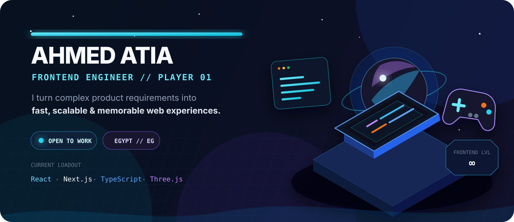

<!-- <div align="center">
  
</div> -->

<br />

<div align="center">
  <a href="https://ahmed-atia-nine.vercel.app/">
    
  </a>
  <a href="https://linkedin.com/in/ahmedatia99">
    
  </a>
  <a href="mailto:atyaa629@gmail.com">
    
  </a>
</div>

## `PLAYER_PROFILE.init()`

```ts
const playerOne = {
  name: "Ahmed Atia",
  class: "Frontend Engineer",
  base: "Egypt",
  mainQuest: "Turn complex product requirements into simple experiences",
  currentBuild: ["React", "Next.js", "TypeScript", "Product Thinking"],
  sideQuest: ["Three.js", "WebGL", "Creative Coding", "Game-inspired UI"],
  status: "Always shipping. Always leveling up.",
};
```

I engineer production web products that balance **clean architecture, sharp visual craft, and real business needs**. My experience covers SaaS dashboards, complex workflows, server state, authentication, caching, performance, accessibility, and bilingual **Arabic RTL / English LTR** interfaces.

> My favorite frontend work feels less like filling a screen—and more like building a world people instantly understand.
<!--
## ⚔️ Main quests

 <table>
  <tr>
    <td width="50%" valign="top">
      <a href="https://itashteeb.com/en">
        
      </a>
      <br /><br />
      <strong>Itashteeb Platform &amp; Dashboard</strong>
      <p>Production construction and finishing ecosystem covering CRM, subscriptions, invoices, add-ons, permissions, inventory, property workflows, notifications, and bilingual product experiences.</p>
      <p><code>React</code> <code>TypeScript</code> <code>Vite</code> <code>React Query</code> <code>i18n</code></p>
      <a href="https://itashteeb.com/en"><strong>Explore Itashteeb ↗</strong></a>
    </td>
    <td width="50%" valign="top">
      <a href="https://ahmed-atia-nine.vercel.app/">
        
      </a>
      <br /><br />
      <strong>Creative Web Lab</strong>
      <p>A growing playground for 3D scenes, game-inspired interfaces, cinematic motion, and interactive browser experiments—built without sacrificing usability or performance.</p>
      <p><code>Three.js</code> <code>GSAP</code> <code>WebGL</code> <code>Framer Motion</code></p>
      <a href="https://ahmed-atia-nine.vercel.app/"><strong>Enter the Lab ↗</strong></a>
    </td>
  </tr>
</table> -->

## 🏆 Boss battles shipped

<table>
  <tr>
    <td width="33%" valign="top">
      <h3>🏠 AmTalek</h3>
      <p>Regional real-estate storefronts and dashboards with OAuth, SEO, caching, localization, package flows, and complex business modules.</p>
      <a href="https://www.amtalek.com/">Visit product ↗</a>
    </td>
    <td width="33%" valign="top">
      <h3>🧭 Product Systems</h3>
      <p>Reusable architectures for CRM, HR, accounting, reports, inventory, permissions, notifications, forms, and multi-step workflows.</p>
      <a href="https://www.e-ramo.net/en">Visit E-Ramo ↗</a>
    </td>
    <td width="33%" valign="top">
      <h3>🌍 Bilingual UX</h3>
      <p>Arabic-first RTL and English LTR interfaces designed as complete experiences—not translations added at the end.</p>
      <a href="https://ahmed-atia-nine.vercel.app/">View my work ↗</a>
    </td>
  </tr>
</table>

## 🎒 Current loadout

<div align="center">
  <p><strong>CORE ENGINE</strong></p>
  <p>
    
    
    
    
    
  </p>
  <p><strong>UI SYSTEMS &amp; STATE</strong></p>
  <p>
    
    
    
    
    
  </p>
  <p><strong>CREATIVE MODE</strong></p>
  <p>
    
    
    
    
    
  </p>
  <p><strong>QUALITY CHECKPOINT</strong></p>
  <p>
    
    
    
    
  </p>
</div>

## 📡 Player activity

```text
Architecture     ██████████████████░░  90%
Product UI       ███████████████████░  95%
Performance      █████████████████░░░  85%
Creative Coding  ██████████████░░░░░░  Leveling up...
```

```diff
+ Building interfaces that feel fast before the metrics even load
+ Turning large business flows into calm, understandable journeys
+ Exploring the space between frontend engineering, 3D and game design
```

## 🛰️ Start a co-op mission

I'm open to **frontend engineering opportunities**, ambitious product teams, and collaborations where strong engineering meets memorable product design.

<div align="center">
  <a href="https://ahmed-atia-nine.vercel.app/"><strong>PORTFOLIO</strong></a>
  &nbsp;•&nbsp;
  <a href="https://linkedin.com/in/ahmedatia99"><strong>LINKEDIN</strong></a>
  &nbsp;•&nbsp;
  <a href="mailto:atyaa629@gmail.com"><strong>EMAIL</strong></a>
  &nbsp;•&nbsp;
  <a href="https://github.com/Ahmedatia99?tab=repositories"><strong>REPOSITORIES</strong></a>
</div>

<br />

<div align="center">
  <sub>Designed &amp; engineered by Ahmed Atia · Built like a product, not a badge wall.</sub>
</div>
